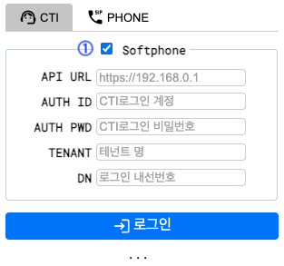
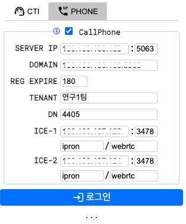
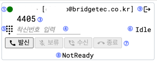
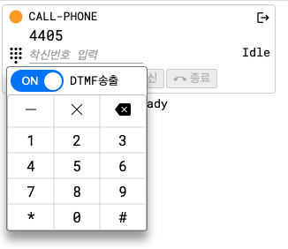
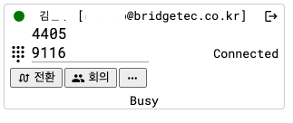

# WebPhone 사용 가이드

로컬에 git clone 받으신후 `softphone-sample.html` 을 웹 브라우저로 열고, 다음의 메뉴얼 절차를 참조하여 이용하시면됩니다.

[sample](softphone-sample.html)

## 로그인 화면 구성

### CTI용 SoftPhone 연결 설정



화면내 다음의 입력항목이 있으며, 마지막 지정값이 기록되어 다음사용시 유지됩니다.

- API URL: API 서버주소 및 포트를 지정합니다. (ex, http://192.168.123.2)
- AUTH ID: 로그인에 사용되는 email 주소
- AUTH PWD: 로그인 비밀번호
- TENANT: 로그인 테넌트 이름

CTI 로그인을 기반으로 통화 콜제어 사용하기 위해서는 ①번 체크박스를 활성화하세요. 

### SIP용 CallPhone 연결 설정



SIP REGISTER 기반으로 통화 콜제어 사용하기 위해서는 ①번 체크박스를 활성화하세요. 

> 주) CTI 로그인 기반으로 콜제어 체크박스가 같이 활성화 되어 있으면, CTI를 통해 콜제어를 수행합니다.

## 기본화면 구성



1. 사용자 상태 표시 및 변경 버튼
2. 로그인된 사용자정보 표시 영역
3. 로그인된 사용자 내선번호 표시 영역
4. 착신번호 표시 및 입력 영역
5. 착신번호 입력용 다이얼패드 버튼
6. 내선의 상태표시 영역
7. 콜 제어용 버튼 영역
8. 로그인된 상담사의 상태표시 영역
9. 로그아웃 버튼


### 로그인된 사용자정보 표시 영역

로그인이 완료되면 로그인한 상담사ID정보가 해당 영역에 표시됩니다.

또한 상담사의 현재 상태가 ⑧ 영역에 나타나고, 상담사 변경을 위해 LED 버튼을 선택한 후 변경할 상태를 선택하시면됩니다.

> 주) SIP용 CallPhone 전용 사용으로 로그인 한 경우에는 `CALL-PHONE` 으로 사용자정보가 표시됩니다.


### 착신번호 표시 및 입력 영역

다이얼 아이콘을 선택하여 버튼식으로 번호입력을 하거나 입력박스를 통해 키입력을 할수 있습니다.



SIP용 CallPhone 활성화하여 로그인한 경우에는 다이얼패드 의 `DTMF송출` 체크박스를 활성화하는 경우 통화연결상태에서 DTMF를 상태측에 전송할수 있습니다.

### 콜 제어용 버튼 영역


- 발신 : 전화걸기 버튼, 보류상태에서 발신버튼을 선택하면 협의 발신이 이루어 집니다.
- 보류 : 현재 통화 상태를 보류상태로 변경합니다.
- 해제 : 보류상태의 통화를 보류해제 합니다.
- 수신 : 수신콜에 대해 받기를 합니다.
- 종료 : 현재의 통화콜을 종료합니다. 협의 통화상태인 경우 협의콜이 종료됩니다.


콜 제어용 버튼영역은 콜의 상태에 따라 버튼이 활성화되며, 통화상태에서 "..." 을 통해 호전환 또는 3자통화를 할 수 있습니다.



> 주) 호전환, 3자통화를 하는 경우 현재 1개의 콜만 있으면 Single Step Transfer 또는 Single Step Conference 로 동작되며, 협의콜이 있는 경우 Mute Transfer 또는 Mute Conference 로 동작됩니다. 


## softphone 임베디드 사용

다른 웹 페이지에서 iframe 형식으로 임베디드 사용하는 경우 다음을 참조하세요.


```html
<!DOCTYPE html>
<html>
	<head>
		<meta charset="utf-8" />
		<title>IPRON Browser Phone</title>
	</head>
	<body>
		<div>
			<iframe id="softphone" allow="camera *; microphone *" src="softphone.html"></iframe>
		</div>
	</body>
	<style>
		#softphone {
			float: right;
			border-style: none;
		}
	</style>
	<script>
		window.addEventListener('message', function(e) {
			switch (e.data.event)
			{
			case "resize":
				document.getElementById('softphone').height = e.data.height;
				document.getElementById('softphone').width = e.data.width;
				break;
			case "event":
				// 콜 또는 상담사 이벤트 수신 처리
				console.log(e.data.data)
			}
		})
	</script>
</html>
```

## License

This project is licensed under the MIT License - see the [LICENSE](LICENSE) file for details.

© 2025 BridgeTech Inc.
